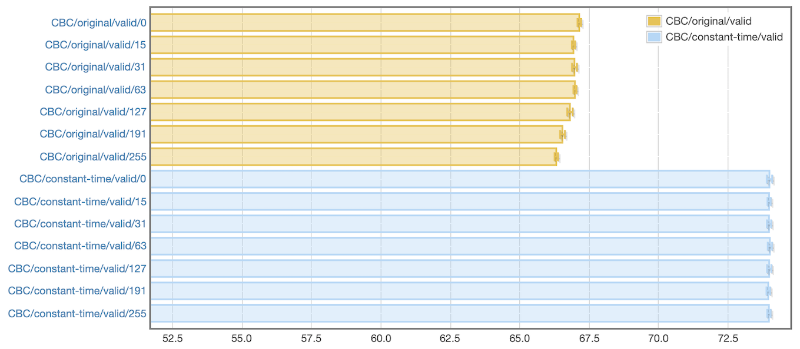

# crypto-cbc

Extends [`cryptonite`](https://hackage.haskell.org/package/cryptonite) hash
implementations in order to process CBC-padded messages in constant time.

The diagram below compares the `original` implementation of CBC-mode present in
`tls` with a `constant-time` implementation.  Execution time is displayed for
several padding lengths, keeping the total length constant.

duration in µs, [full criterion report](benchs/bench.html)

Notes:

- To make the benchmark code simpler, some elements of the implementation were
  removed to focus only on CBC padding.  Instead of authenticating with HMAC,
  the code only tests integrity with the hash algorithm alone.

- Parameters are as follows: integrity with SHA-256, message length of 16384
  bytes, padding between 0 and 255 bytes, TLS padding validation.

- New code still contains a small timing leak due to excessive reliance on
  `Bool` constructors.  An expression like `digestValid &&! paddingValid`
  requires separate branching for both boolean conditions instead of a global
  branch to handle the final the result.  This is minor and can be resolved by
  replacing the intermediate `Bool` values with a datatype like `newtype
  CryptoBool = CryptoBool Word` and using arithmetic AND operator.  Currently
  the code still uses `constEq` from module `Data.ByteArray` which returns a
  `Bool`.
